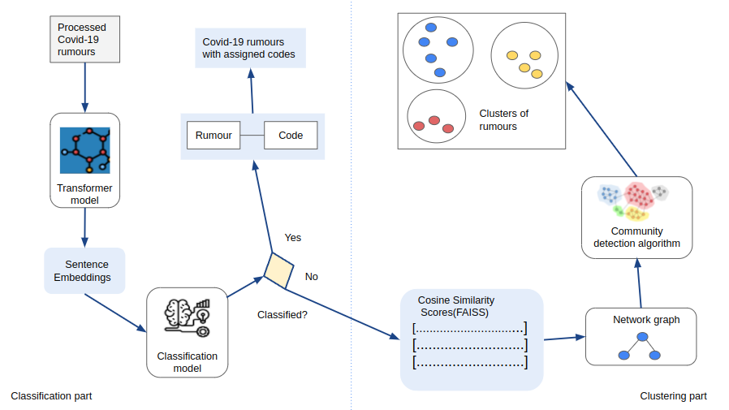

# Collective Crisis Intelligence Project for The Cameroon Red Cross

# Contents

- [Background](#background)
- [Overview of the prototype](#overview-of-the-prototype)
- [Model workflow](#model-workflow)
  - [Data preprocessing](#data-preprocessing)
  - [The classification model](#the-classification-model)
  - [The clustering model](#the-clustering-model)
- [Running the models](#running-the-models)
  - [Steps to take before running the model](#steps-to-take-before-running-the-model)
  - [Pre-trained models (classification)](<#pre-trained-models-(classification)>)
  - [Input needed](#input-needed)
  - [Run the models](#run-the-model)
  - [Outputs](#outputs)
- [Using the tool](#using-the-tool)

# Background

The outbreak of COVID-19 witnessed an avalanche of rumours and misinformation as people around the world grappled with the disease. The Cameroon Red Cross (CRC) needed a way to both identify and address the rumours and misinformation that was arising on covid-19. With the help of the International Federation of the Red Cross (IFRC), the CRC have been collecting feedback from communities on covid-19 including rumours, beliefs and observations. So far the approach of collecting, coding and acting on these rumours has been manual, where members of the IFRC assign new rumours to codes and the CRC address new rumours with an appropriate response through different channels.

This project explores ways to use supervised and unsupervised machine learning methods to both classify rumours to existing codes and suggest new rumour groups for the CRC to address.

# Overview of the prototype

The prototype tool handles new rumours in two steps. First it tries to classify them to one of the existing eight codes using a predictive model. If the rumour does not fit one of these codes it is added to a pool of unmatched data points to be clustered into different groups. Figure 1 summarises the major steps of the prototype.

Figure 1: System Components

# Model workflow

## Data preprocessing

Obtained data on COVID-19 was preprocessed before use. The majority of the comments found in the dataset are in French. Comments found in other languages such as English were translated into French using the google translator library. Next we inspected the distribution of comments into the various codes present. Data points corresponding to 8 labels were retained for model development. Using workshop sessions conducted by CRC volunteers, data labeling exercise was conducted in which different groups did label the same data point thrice. Using a majority vote, data points which got the majority vote were retained. The pre-processed data is split into a train/test datasets and saved in the outputs/data directory. The script used in the data pre-processing is [data_splitting.py](https://github.com/nestauk/cci_cameroon/blob/10_model_pipeline/cci_cameroon/pipeline/data_splitting.py)

## The classification model

The cleaned data was split into train/test sets using the proportion 80:20. Different models and their hyperparameters were tested using a combination of gridsearch and k-fold cross validation on the training set. The best performing model was chosen by using the F1 micro metric. K-nearest neighbours classifier was found to have the best performance overall. Functional programming was used with sklearns pipeline to optimise the model tuning and development process.

The steps taken to develop the classification model can be found in the file [classification_model_development.py](https://github.com/nestauk/cci_cameroon/tree/10_model_pipeline/cci_cameroon/analysis/model_development).

As shown in the figure, once the comments are cleaned, they are fed into an instance of `french_semantic` transformer model which creates numerical representations (embeddings) of the data. The embeddings are used to train a K-neighbors classifier.

New data points from the test set are then introduced into the model which tries to match each data point to an existing label. Where the probability of a data point belonging to a label is less than a threshold of 0.5, the data point is treated as unknown. These unclassified data points are then fed into the clustering algorithm which produces groups.

## The clustering model

The clustering model development is performed in a file named [clustering_model_development.py](https://github.com/nestauk/cci_cameroon/tree/10_model_pipeline/cci_cameroon/analysis/model_development). The process followed by the clustering algorithm is summarized by the steps below:

- For each data point, using cosine similarity,the top 5 most similar data points are fetched from the dataset using FAISS flat index. The output of this step is a matrix where each entry is the cosine similarity score between two data points.
- Using the cosine similarity score matrix, a graph network is constructed where the nodes are the individual data points. An edge occurs between two nodes A and B if node B is among the top 5 most similar nodes to A.
- The resulting network is fed into a community detection algorithm. This produces clusters of comments as output.

# Running the models

The final scripts for the classification (`classification_model_run.py`) and clustering (`clustering_model_run.py`) models and are found in [pipeline directory](https://github.com/nestauk/cci_cameroon/tree/10_model_pipeline/cci_cameroon/pipeline/model_run) in a folder called `model_run`. The scripts use the held out test dataset to first classify the rumours and then cluster the rumours that cannot be classified. Both scripts can be run separately and can use any new rumour datasets that are in the correct format (contain a comment field for predicting and clustering).

## Steps to take before running

To run the models you will first need to setup the project by following the steps below:

1. Clone the project and cd into `the cci_cameroon` directory
2. Run the command `make install` to create the virtual environment and install dependencies
3. Inside the project directory run `make inputs-pull` to access the data from S3 (for those with access to the Nesta S3 account)
   To note the project is setup using the Nesta Cookiecutter (guidelines on the Nesta Cookiecutter [can be found here](https://nestauk.github.io/ds-cookiecutter/structure/)).

## Pre-trained models (classification)

The pre-trained classification model is saved to `outputs/model`. This model is fitted using the same IFRC dataset that the test set came from. The script to run the file is in the pipeline folder and is called `classification_model_save.py`

The MultiLabelBinarizer model is used to access the classes to create the predictions dataset. This model is also created and saved to outputs by running `classification_model_save.py`.

## Input needed

After you setup the project you will need your test dataset. To build our models we used the dataset provided to us by the IFRC and Cameroon Red Cross containing rumours, beliefs and observations from community members (more information on the data source can be found on the IFRC.Go website). To run the scripts the data needs to be in the following format:

Filename: `X_test.xlsx`
Saved in `inputs/data/data_for_modelling/`
id comment
numeric rumour text
The reason for having an ID column is so you can reference back the prediction files to the original test dataset (if needed for reporting results).

## Run the models

Perform the following steps to run the models:

1. cd into `pipeline/model_run`
2. run `python3 classification_model_run.py`
3. run `python3 clustering_model_run.py`

## Outputs

There are three files created from running the models and saved to outputs:

- `all_predictions.xlsx`
- `not_classified.xlsx`
- `clusters.xlsx`

The first two are created from the `classification_model_run.py` file and the third is created from `clustering_model_run.py` file. If a rumour is classified by the model to one or more of the eight codes it is saved in the `all_predictions.xlsx` file. If the rumour cannot be classfied it is saved into the the `not_classified.xlsx` file. Both files also save the rumours ID assigned so it can be referenced back to the test set for reporting.

The `not_classified.xlsx` file is used as input to run the clustering algorthm in the clustering_model_run.py file in the same folder.

The `clusters.xlsx` file contains the unclassified comments broken into the clusters chosen by the clustering model. Each cluster in saved as a seperate sheet in the excel file.

# Using the tool

The Collective Crisis Intelligence project for the Cameroon Red Cross aims at developing a prototype of an Artificial Intelligence system that can be used to classify comments in the context of covid-19. The aim of the tool is to both help volunteers in the field provide appropriate and timely responses to community members' comments and CRC staff to handle large groups of unknown rumours. Figure 1 summarises how the tool could be used.

Figure 2: How the tool is used
