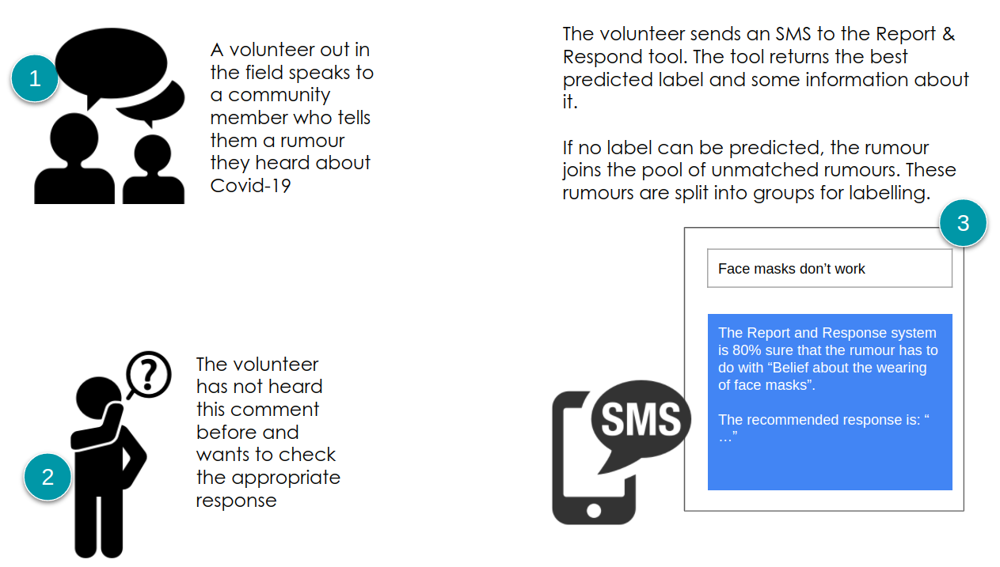

<!-- #region -->

# Collective Crisis Intelligence Project for The Cameroon Red Cross

**_Public repository for hosting the technical outputs of the CCI Cameroon project._**

## Welcome!

This repository contains the code and documentation for a project that uses Collective Crisis Intellegence (CCI) with the aim of helping the Cameroon Red Cross to track and respond to misinformation in realtime.

### Background

The scale and spread of misinformation and disinformation is a growing challenge for humanitarian organisations. [The Cameroon Red Cross (CRC)](https://www.icrc.org/en/where-we-work/africa/cameroon) needed a way to both identify and address the rumours and misinformation that was arising on Covid-19.

The CRC collects community feedback, including rumours and beliefs about COVID-19, through a network of volunteers. After community feedback is collected, the CRC submits the full dataset to a data analyst based at the regional International Federation of the Red Cross (IFRC) cluster team who cleans the data and assigns labels to different categories of rumours, beliefs and observations.

The Collective Crisis Intelligence project for the Cameroon Red Cross aims at developing a prototype of an Artificial Intelligence system that can handle new rumours by either matching them to existing rumour categories or grouping them into new ones. The aim of the tool is to both help volunteers in the field provide appropriate and timely responses to community members' comments and CRC staff to handle large groups of unknown rumours. Figure 1 summarises how the tool could be used.


Figure 1: How the tool is used

The prototype tool handles new rumours in two steps. First it tries to classify them to a set of known categories (codes) using a predictive model. If the rumour does not fit one of these codes it is added to a pool of unmatched data points to be clustered into different groups. Figure 1 summarises the major steps of the prototype.


Figure 2: System Components

The pipelines provided in this repository generates two outputs:

1. A classification model that classfies rumours into existing categories
2. A clustering model that finds new groups of rumours from a pool of rumours that cannot be classified

Find out more about the project in our report (coming soon).

## Contents

`Published on July xx, 2022`

- [**Model workflow**](https://github.com/nestauk/cci_cameroon/tree/10_model_pipeline/cci_cameroon/pipeline/model_workflow): Python code for training the models and applying to the test data.
- [**Classification model development**](https://github.com/nestauk/cci_cameroon/tree/10_model_pipeline/cci_cameroon/analysis/classification_model_dev): Classification models tuning on the training set to find optimum models and parameters.
- [**Clustering model development**](https://github.com/nestauk/cci_cameroon/tree/10_model_pipeline/cci_cameroon/analysis/clustering_model_dev): Testing of different clustering methods and parameters to develop an optimum model.

## Data

To build the models we used community feedback data related to COVID-19 collected by the CRC with help from the IFRC. This dataset forms part of an ongoing collection of COVID-19 community data by the IFRC and regional RC societies. Each Red Cross society collects questions, feedback suggestions, rumours, beliefs and observations from community members across the country through different channels such as social media, focus groups and radio. This data is then sent to the IFRC to be processed which includes assigning observations to a code to represent its topic. More information on this data collection process can be found on the [IFRC.Go platform](https://go.ifrc.org/emergencies/4583#community-data). This dataset contains 6,702 observations which contain the rumour text as well as information about how the rumour was collected and its assigned code.

#### Selecting data for modelling

As a first step we manually inspected some of the comments assigned to each of the codes. We noticed a lot of variation in the quality of the codes and the number of comments assigned. Some of the codes were very broad such as ‘other beliefs about the disease’ and many only had a few comments assigned.

For this reason we decided to only select a small subset of the codes to use as target variables for our classification model. To select the codes we designed and ran an activity with CRC staff to prioritise the codes to be used in modelling. The chosen codes are listed below.

```
codes = [
    "Belief that some people/institutions are making money because of the disease",
    "Belief that the outbreak has ended",
    "Belief that disease does exist or is real",
    "Belief that the disease does not exist in this region or country",
    "Beliefs about hand washing or hand sanitizers",
    "Beliefs about face masks",
    "Beliefs about ways of transmission",
    "Observations of non-compliance with health measures",
]
```

#### Cleaning the data using participatory methods

In our initial inspection we identified a number of cases where rumours were assigned to the codes that did not reflect their meaning. To understand the extent of this issue and to attempt to mitigate it, we ran a series of workshops with CRC staff and volunteers that asked participants to review each rumour and make a judgement on whether the code assigned was correct. Each rumour was reviewed three times by different volunteers or Red Cross staff and the consensus vote was used to either keep or remove that rumour and code pairing.

## Installation

### Clone and set up the repo

To run the models you will first need to setup the project. Follow the steps below to do this:

1. Meet the data science cookiecutter [requirements](http://nestauk.github.io/ds-cookiecutter/quickstart), in brief:

- Install: `git-crypt` and `conda`
- Have a Nesta AWS account configured with `awscli`

2. Run:

```shell
$ git clone https://github.com/nestauk/cci_cameroon
$ cd cci_cameroon
```

3. Run `make install` to configure the development environment:

- Setup the conda environment
- Configure pre-commit
- Configure metaflow to use AWS

4. Inside the project directory run `make inputs-pull` to access the data from S3 (for those with access to the Nesta S3 account)

To note the project is setup using the Nesta Cookiecutter (guidelines on the Nesta Cookiecutter can be [found here](https://nestauk.github.io/ds-cookiecutter/structure/)).

### Split the data

For modelling purposes we split the data into training and test sets. As input we used the cleaned files of comments and codes from the partipatory workshops (defined in 'Cleaning the data using participatory methods') and a sample of data from the original IFRC rumours, beliefs and observations dataset. For internal use these are saved in the projects S3 bucket. If you don't have access to these files you can skip this step.

```shell
python cci_cameroon/pipeline/data_splitting.py
```

##### Outputs

The following files created from running the `data_splitting.py` file. These are saved in `inputs/data/data_for_modelling` and are listed below. The last two files are used to help the model improve its accuracy predicting 'no response' rather than one of the eight codes.

These form the training and test sets used for modelling.

- `X_train.csv`
- `X_test.csv`
- `y_train.csv`
- `y_test.csv`
- `no_response_train.csv`
- `no_response_test.csv`

### Save and run the models

#### Save the classification model

Run the below python file to train and save the classification model. This requires the above training and test files in the format:

- X_train, X_test, no_response_train, no_response_test: rumour_id (unique integer), rumour text (string)
- y_train, y_test: rumour_id (unique integer), codes assigned (list of codes)

```shell
python cci_cameroon/pipeline/classification_model_save.py
```

##### Outputs

The pre-trained classification model is saved to `outputs/model/final_classification_model.sav`. This model is fitted using the same IFRC dataset that the test set came from. The MultiLabelBinarizer model (mlb) is used to access the classes to create the predictions dataset. This model is also created and saved to `outputs/model/mlb.pkl`.

#### Run the models

Move into the `model_workflow` folder and run the following file to run the models.

Perform the following steps to run the models:

```shell
$ python cci_cameroon/pipeline/model_workflow/classification_model_run.py
$ python cci_cameroon/pipeline/model_workflow/clustering_model_run.py*
```

\*We have found that running this file on a Mac can sometimes encounter errors. If you experience this you can run a version of this file on Google Colab. The version that can be run on Google Colab is saved in the same folder and is called `clustering_model_run_colab.py`. Use Jupytext to create a notebook version of this file and upload it to google colab (check the markdown in the notebook for instructions on how to run).

### Final Outputs

There are three files created from running the models and saved to outputs:

- `all_predictions.xlsx`
- `not_classified.xlsx`
- `clusters.xlsx`

The first two are created from the `classification_model_run.py` file and the third is created from `clustering_model_run.py` file. If a rumour is classified by the model to one or more of the eight codes it is saved in the `all_predictions.xlsx` file. If the rumour cannot be classfied it is saved into the the `not_classified.xlsx` file. Both files also save the rumours ID assigned so it can be referenced back to the test set for reporting.

The `not_classified.xlsx` file is used as input to run the clustering algorthm in the clustering_model_run.py file in the same folder.

The `clusters.xlsx` file contains the unclassified comments broken into the clusters chosen by the clustering model. Each cluster in saved as a seperate sheet in the excel file.

## Technical Specifications

The models contained within this repository were incorporated within wider technical architecture within the Report & Respond and Labelling tools. These tools were evaluated using high-fidelity prototypes, and a technical specification is enclosed within this repository `outputs/reports/technical-spec` which outlines a proposed implementation of the wider tool architecture and how the model can be integrated. There is also Adobe XD files included which show the prototype tools.

## Directory structure

The repository has the following main directories:

```
  ├── cci_cameroon                          <- Packaged code (various modules, utilities and readme)
  │   ├── analysis
  │   │   ├── classification_model_dev      <- Model tuning on the training set to find optimum models and parameters
  │   │   ├── clustering_model_dev          <- Testing and development of clustering model
  │   │   ├── data_scoping                  <- Exploratory data analysis of various datasets
  │   │   ...
  │   ├── config                            <- Holds variables, feature names and parameters used in the codebase
  │   ├── getters                           <- Functions for getting the data
  │   ├── pipeline                          <- Holds scripts for all pipeline components
  │   │   └── model_workflow                <- Runs models on test data
  │   ├── utils                             <- Utility functions needed across different parts of the codebase
  │   ...
  ├── inputs
  │   └── data                              <- Holds the IFRC data and outputs from the workshops
  │   ...
  └── outputs
      ├── data
      │   └── data_for_modelling            <- Training and test sets saved here
      ├── models                            <- Saved models after running model_workflow
      ├── reports
      ├── └── technical-spec                <- Technical specifications for UI prototypes
      ├──     └── xd-files                  <- Adobe XD files for two UI prototypes
      ...

```

## Contact and Contributions

This repository is maintained by the Data Analytics Practice team at [Nesta](https://www.nesta.org.uk/). The CCI Cameroon project is an ‘Accelerated Innovation Collaboration’ (AIC) which was delivered by Nesta’s Centre for Collective Intelligence Design (CCID) and Data Analytics Practice (DAP), UK HIH, [Open Lab](https://openlab.ncl.ac.uk/), [IFRC Red Crescent Societies - Solferino Academy](https://solferinoacademy.com/), [Cameroon Red Cross Society](https://www.ifrc.org/national-societies-directory/cameroon-red-cross-society) and [Nepal Red Cross Society](https://nrcs.org/).

We welcome any feedback and questions. Please email dataanalytics@nesta.org.uk.

<!-- #endregion -->
