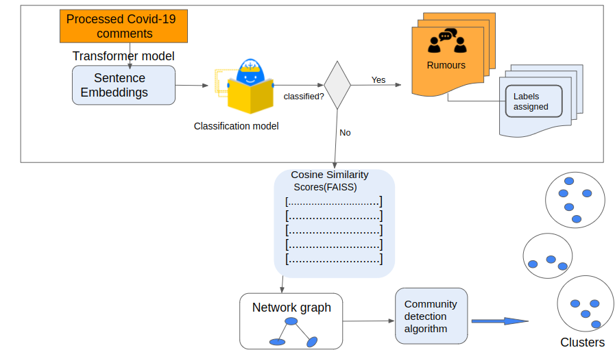

# Collective Crisis Intelligenge Project for Cameroon

## Background

The outbreak of COVID-19 witnessed an avalanche of disinformation/rumours as people around the world grappled with the disease. Thus the need for identifying and handling of disinformation/rumours. The International Federation of the Red Cross - IFRC collects covid-19 data from community members in countries in Africa including Cameroon. This project uses the collected data to develop an Artificial Intelligence prototype that can classify the comments collected from the communities.

## Introduction

The Collective Crisis Intelligence project on Cameroon aims at developing a prototype of an Artificial Intelligence system that can be used to classify comments in the context of covid-19.

So my thinking is that we do the following:
On the main readme (found here):

This will give a thorough description of: background to the project, preprocessing of data and the building and running of both models
Here we can also provide links to different parts of the repo where different bits of code are kept
In the pipeline folder:
General pipeline scripts:
Scripts to preprocess the data and build the models (helper functions ect)
A script to split the data into training and test sets
A script that trains the optimum classification model and saves the model (this one)
'Models_run' folder:
This will contain the scripts needed to run both models
This will also include a readme explaining the steps you need to take to run the models
For the clustering model, I copied your script rumour_clustering_test.py and named it 'clustering_model_run'
In the analysis folder:
A model development folder:
This can contain both the clustering and classification model development files
This doesn't require a readme and doesn't need to be reviewed by George/Jyl/Saurav (George stated this as its more testing we have done rather than what is needed to run the models)
We could have sub folders in here 'classification' and 'clustering' depending on how many files we have
We might also want to include here the script that takes in the different sizes of comments and produces visualisations / metric results for the report (as suggested by Jyl and George but maybe this depends how much time we have)
Does that make sense? Can have a call tomorrow to discuss if you like? Looks like you've done loads of great work describing the clustering algorthm and how to run the model already its just a case of placing this information in the correct places :slightly_smiling_face:

Figure 1: System components

## Data preprocessing

Obtained data on COVID-19 was preprocessed before use. The majority of the comments found in the dataset are in French. Comments found in other languages such as English were translated into French using the google translator library. Next we inspected the distribution of comments into the various codes present. Data points corresponding to 8 labels were retained for model development. A summary of the codes and their counts is shown below.
