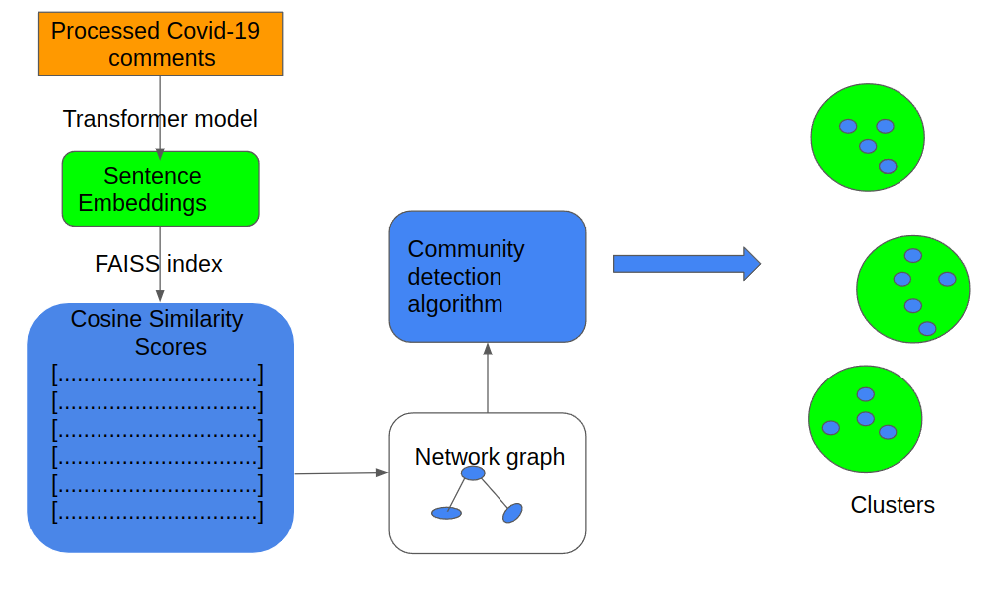

<!-- #region -->

# Clustering algorithm

## Introduction

This document summarises the approach used to prototype a tool that forms clusters from comments collected by the Cameroon Red Cross in the context of COVID-19 pandemic. The project is in two parts: one that uses supervised learning to classify comments into various categories; and a second that clusters comments that could not be assigned to any of the existing categories at a level of confidence. The goal of the exercise is to facilitate the process of assigning codes/labels to the comments and providing appropriate responses to communities in case of identified disinformation.

In the sections that follow, we describe the source of data and how the comments were processed. Attention is then focused on using Natural Language Processing NLP techniques to prepare and cluster the data. Figure 1 shows the key stages of the process.



<!-- #endregion -->

<!-- #region -->

Figure 1: Key stages of the process

## Data collection

About 17000 data points on Covid-19 collected by the International Federation of the Red Cross - IFRC from communities in Cameroon were obtained. Of these, 1300 comments belonging to 8 different categories were retained for the classification model development. The retained comments are centred on beliefs, observations and rumours which are of particular interest to us.

## Data preprocessing

Obtained data on COVID-19 was preprocessed before use. The majority of the comments found in the dataset are in French. Comments found in other languages such as English were translated into French using the google translator library. Next we inspected the distribution of comments into the various codes present. Data points corresponding to 8 labels were retained for model development. A summary of the codes and their counts is shown below.

| ----------------------------------- label ------------------------------------------------ | --comment count - |
| ------------------------------------------------------------------------------------------ | ----------------- |
| Croyances sur les moyens de transmission                                                   | 319               |
| ------------------------------------------------------------------------------------------ | --------------    |
| Croyance que certaines personnes / institutions gagnent de l'argent à cause de la maladie  | 187               |
| ------------------------------------------------------------------------------------------ | --------------    |
| Croyance que l'épidémie est terminée                                                       | 160               |
| ------------------------------------------------------------------------------------------ | --------------    |
| Observations de non-respect des mesures de santé                                           | 137               |
| ------------------------------------------------------------------------------------------ | --------------    |
| Croyance que la maladie n'existe pas dans cette région ou dans ce pays                     | 132               |
| ------------------------------------------------------------------------------------------ | --------------    |
| Croyances sur le lavage des mains ou les désinfectants des mains                           | 128               |
| ------------------------------------------------------------------------------------------ | --------------    |
| Croyances sur les masques de visage                                                        | 122               |
| ------------------------------------------------------------------------------------------ | --------------    |
| Croyance que la maladie existe ou est réelle                                               | 105               |
| ------------------------------------------------------------------------------------------ | --------------    |

Through organized workshop activities with volunteers, the labels assigned to the comments were assessed and the data quality improved. Preprocessing was conducted in the notebook [file_name.py]

## Capturing the meanings of the comments

To cluster sentences together, the algorithm used needs to capture their meaning. Numerical representations (embeddings) of the comments are first created using a transformer model. A transformer model is a type of neural network which is pretrained on large volumes of text to learn the relationships between different words in a particular language. These models would later transfer the knowledge learned to generate numerical representations of other texts in the same language. In our case we employed the french semantic transformer model. We selected the french semantic transformer model because its embeddings produced better results than others tested. The code that evaluates the performance of transformer models on French text in found in the notebook similarity_search_sample.py

## Calculating similarity

After generating numerical representations of the comments using the transformer model, we proceeded to compute similarity scores for n neighbors of each data point. To compute the similarities faster, we used Facebook Artificial Intelligence Similarity Search FAISS library. Based on the CRC's rate of data collection, the algorithm will be run each time with less than a thousand or so new comments. This data size led us to use a flat FAISS index for accuracy. This also guarantees a quick search given the data size. We then calculate the cosine similarity score between the embedding of each comment and the top 5 similar comments in the pool. The final output of this stage is, for each comment, a list of the 5 most similar comments and their cosine similarity scores. The output of this step is an adjacency matrix whose inputs are cosine scores. The adjacency matrix is generated using util functions found in the notebook clustering_helper_functions.py under the pipeline directory.

## Generating a graph network

Having identified the 5 most similar comments to each comment, a network is generated using the adjacency matrix. information. The nodes in the network are the individual data points in the dataset. An edge exists between node A and node B if data point B is among the top 5 similar data points to data point A. To ensure that distinct comments stand alone, we set a minimum threshold for the similarity score of 0.3. Thus an edge is formed between node A and node B in the graph if the cosine similarity score between the embedding of sentence A and that of sentence B is at least 0.3. The networkx module is used to generate the connectivity graph.

In the next step, the generated graph is fed into a community detection algorithm to group the data points into different clusters. Clustering algorithm like K-Means is not used because the number of suitable clusters is not known a priori. With growing data sizes, we expect the optimal number of clusters to change. The community detection algorithm used is leiden from the cdlib library. Leiden algorithm is used it builds on randomwalk and laivan algorithms. A helper function that colors the different communities formed from the graph is found in the cluster_helper_functions.py notebook under pipeline.

## Set up and run the model

Perform the following steps to set-up and run the project:

- clone the project and cd into the cci_cameroon directory
- run the command make install to create virtual environment and install dependencies
- run python3 clustering_model_test.py

Once run, the model takes in a dataset and performs the following:

1. Creates numberical representations (embeddings) of the sentences using a transformer model
2. Searches for the five most similar comments to each data point using a FAISS index
3. Generates an adjacency matrix using the cosine similarity scores where the nodes are the different data points and the edges the cosine similarity scores
4. Use the matrix to generate a graph network
5. The network is then fed into a community detection model which produces the clusters

## Final output

The final output of the model are the created clusters. These are saved in excel file clusters.xslx under the outputs/data directory. Each cluster is saved in a different worksheet for later inspection by a personel.

<!-- #endregion -->

```python

```

```python

```
